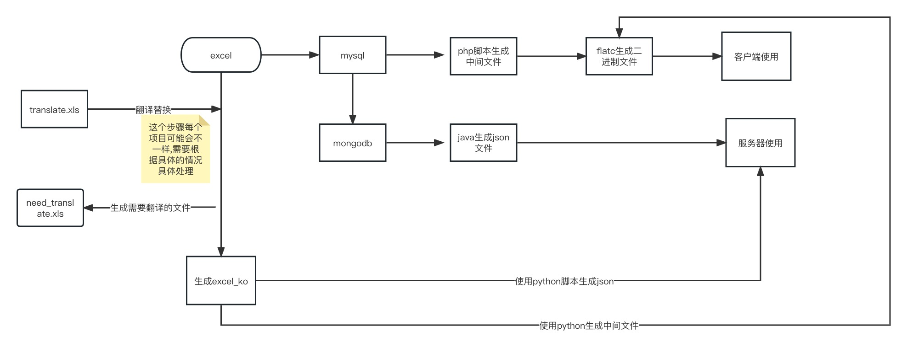
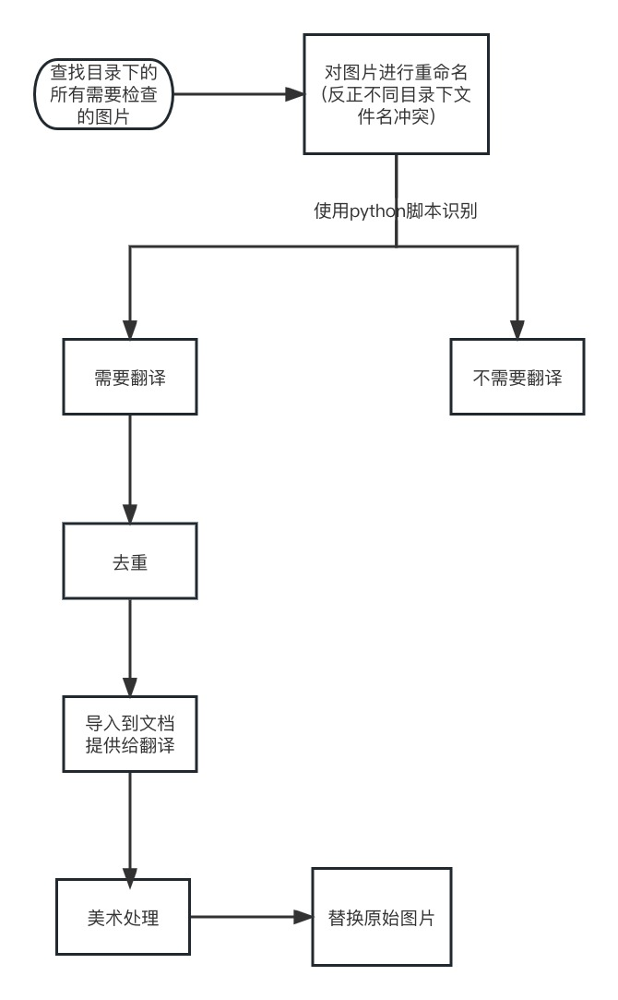

# Unity 游戏的多语言(韩语)翻译


## 说明

此次分享,主要是以分享妖神记做多语言(韩语)的一些经验


## 1.背景说明

- 自研项目: 妖神记 

- 目标: 不做任何修改,只做多语言.

## 2.工作内容

- 原始工程的版本是unity5.6 不支持64位 需要升级到2018.3

- 重新接入海外sdk(一般自研项目,可能之前已经接入过qipa的sdk 接入一般都比较简单)

- 热更流程(熟悉哪些能热更,哪些不能热更)

- 打包流程(打热更资源,分包处理)

- ....................................................

- 配置表翻译(重点)

- 图片翻译(重点)

- 代码翻译(重点)

- 预制体翻译(重点)

- 剧情翻译(重点)

- 翻译完成后调整布局

- 通过去重减少翻译的数量

- 通过调用api给需要翻译的文本一个推荐

- 通过公司的翻译库来减少翻译的工作

- 通过每个游戏设定一个专有名称的库来提高反应的准确度跟速度

## 3.配置表翻译



```python
def gen_translate(file):
    # 打开电子表格文件
    workbook = xlrd.open_workbook(os.path.join(table_path, file))
    # 获取第一个工作表
    worksheet = workbook.sheet_by_index(0)
    # 创建一个新的工作簿和工作表
    new_workbook = xlwt.Workbook(encoding='utf-8')
    new_worksheet = new_workbook.add_sheet('Sheet1')
    # 遍历工作表中的所有行
    for row_index in range(worksheet.nrows):
        # 遍历工作表中的所有列
        for col_index in range(worksheet.ncols):
            # 获取单元格的值
            cell_value = worksheet.cell_value(row_index, col_index)
            cell_value = str(cell_value)
            if any('\u4e00' <= c <= '\u9fff' for c in cell_value):
                if cell_value in cache:
                    new_worksheet.write(row_index, col_index, cache[cell_value])
                else:
                    new_worksheet.write(row_index, col_index, cell_value)
                    need_translate.add(cell_value)
            else:
                new_worksheet.write(row_index, col_index, cell_value)
    # 保存新的工作簿
    new_workbook.save(os.path.join(out_path, file))
```

## 4.图片翻译



```python
def load_cache():
    for path in workspace_list:
        # 使用os.walk()函数遍历目录下的所有文件和子目录
        for root, dirs, files in os.walk(path):
            for file in files:
                if file.endswith(extensions):
                    if file in cache:
                        cache[file].append(root)
                    else:
                        cache[file] = [root]
 def findall():
    json_list = []
    index = 1000000000
    def get_name(file):
        nonlocal index
        if file.endswith(png):
            index += 1
            return "ui_" + str(index) + ".png"
        if file.endswith(jpg):
            index += 1
            return "ui_" + str(index) + ".jpg"
        else:
            return file
    for file in cache:
          for path in cache[file]:
              file_path = os.path.join(path, file)
              new_name = get_name(file)
              json_list.append({"path": file_path, "name": new_name})
              shutil.copy(file_path, translate)
              os.rename(os.path.join(translate, file), os.path.join(translate, new_name))
    with open("find.json", 'w', encoding='utf-8') as f:
        f.write(json.dumps(json_list))
```

```python
import easyocr
# 定义要查找的文件后缀名列表
extensions = ('.png', '.PNG', '.jpg', '.JPG')
# 创建EasyOCR对象
#easyocr 准确性90% 所以脚本执行后还需要自己看看是否有遗漏的
#这个也可以替换其他ocr接口,甚至是云服务提供的api接口(百度云图片ocr接口) 如果速度比较慢.可以使用多线程优化
reader = easyocr.Reader(['ch_sim'])  
  
  def checktext(results):
    if len(results) > 0:
        for result in results:
            if any('\u4e00' <= c <= '\u9fff' for c in result):
                return True
    return False

    def check_need_translate():
        file_names = os.listdir(translate)
        for file_name in file_names:
            if file_name.endswith(extensions):
                try:
                    results = reader.readtext(os.path.join(translate, file_name), detail=0, paragraph=False)
                    if checktext(results):
                        shutil.copy(os.path.join(translate, file_name), need_translate)
                    else:
                        shutil.copy(os.path.join(translate, file_name), dontneed_translate)
                    os.remove(os.path.join(translate, file_name))
                except:
                    print("error: " + file_name)
```

美术翻译完成后,根据之前生成的配置文件.找到文件的原始地址进行替换  也是只需要执行脚本就可以

## 5.代码翻译

这个每个项目的差异是比较大的,有多语言规划的项目其实保持原有的多语言逻辑就可以.

```c#
public static class _s_language_ch
{
    //**************************英雄属性主界面和升星界面**************
    public const int u_hero_lv_max = 1;//等级上限
    public const int u_hero_hero_skill = 2;//妖灵师技能：
    public const int u_hero_soldier_skill = 3;//妖灵技能：
    public const int u_hero_hero_skill_allunlock = 4;//妖灵师技能全部解锁字段
    public const int u_hero_uplock = 5;//解锁
    public const int u_hero_lvdemand = 6;//等级需求
    public const int u_hero_upstar_function = 7;//升星
    public const int u_hero_details = 8;//详情
    public const int u_hero_uplevel = 9;//升级
    public const int u_hero_soldier = 10;//妖灵
    public const int u_hero_change = 11;//变身
    public const int u_hero_lock = 12;//锁定
    public const int u_hero_unlock = 13;//解锁
    public const int u_hero_upstar = 14;//升星
    public const int u_hero_tip_lv = 15;//妖灵师需达到当前最大等级才能升星
    public const int u_hero_tip_sucai = 16;//未选择升星素材
    public const int u_hero_tip_silver = 17;//金币不足
    public const int u_hero_mainctr_close = 18;//妖灵师
    public const int u_hero_curstar_already = 19;//当前星级已满
    public const int u_hero_sucai_silver = 35;//素材不足
    public const int u_hero_upskill_title = 36;//技能提升
    public const int u_hero_upskill_lv = 37;//等级.
    public const int u_hero_upskill_ok = 38;//确定
    public const int u_hero_soulSea = 82;//灵魂海
    //...................................
}

public void awake()
{
  allFinish.transform.Find("Text").GetComponent<Text>().text = SLanguageChMgr.Instance.GetLanguageChValBykey(_s_language_ch.ui_family_new_mission_btnstate4);
}

```

这个所有的语言其实都是在配置表里面的


对于前期没有多语言规划,这里跟大家探讨一个修改代码中多语言的最佳实践

- 通过自带的多语言组件Localization来处理文本
- 跟上面一样的方案,就是价格key做多语言
- 直接脚本替换

## 6.预制体翻译


预制体有两种存储方式：使用 Text 存储和使用二进制存储。

1. 使用 Text 存储 预制体使用 Text 存储时，预制体的信息以文本的形式存储在文本文件中。这种存储方式比较容易理解和修改，但是读取速度比二进制存储慢。
2. 使用二进制存储 预制体使用二进制存储时，预制体的信息以二进制的形式存储在二进制文件中。这种存储方式读取速度比 Text 存储方式快，但是不利于人类的理解和修改。

预制体使用 YAML 格式存储时，预制体的信息以文本的形式存储在 YAML 文件中。这种存储方式具有易读性和易操作性，而且支持多种语言，包括 Python。因此，如果你需要使用 Python 脚本来处理预制体信息，建议使用 YAML 格式来存储预制体信息。

## 7.剧情翻译

妖神记的游戏中,剧情实际上也是以预制体的形式来保存的.所以翻译的方式跟预制体翻译大同小异,只是查找中文文本跟替换文本的适用规则不同


## 8.美术图片翻译辅助工具

使用[Magic Eraser : Remove unwanted things in seconds (magicstudio.com)](https://magicstudio.com/zh/magiceraser)


